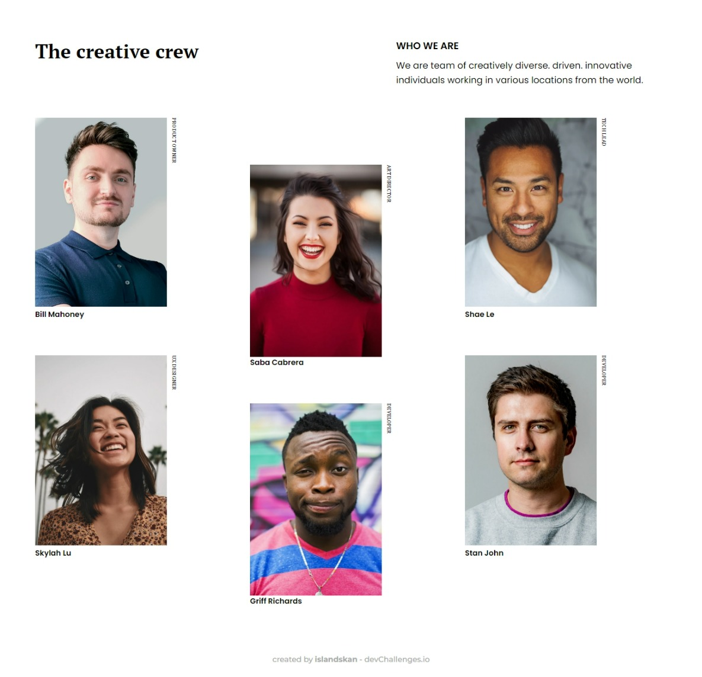
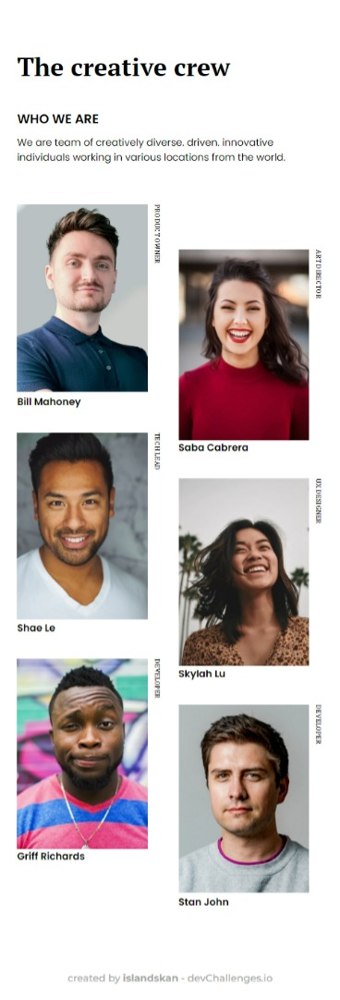

<!-- Please update value in the {}  -->

<h1 align="center">Devchallenges: My team page</h1>

   Solution for a challenge from  <a href="http://devchallenges.io" target="_blank">Devchallenges.io</a>.

  <h3>
    <a href="https://islandskan-my-team.netlify.app/">
      Demo
    </a>
     | 
    <a href="https://github.com/islandskan/devchallenges-responsive-my-team-page">
      Solution
    </a>
     | 
    <a href="https://devchallenges.io/challenges/hhmesazsqgKXrTkYkt0U">
      Challenge
    </a>
  </h3>

<!-- TABLE OF CONTENTS -->

## Table of Contents

- [Overview](#overview)
  <!-- - [Built With](#built-with) -->
- [Features](#features)
- [Contact](#contact)
- [Acknowledgements](#acknowledgements)

<!-- OVERVIEW -->

## Overview

My second devchallenges challenge in the "Responsive Web Developer"-path: Building a page for a team.

The challenge:
Create a "My team"-page following the design. The page should be responsive.

User story:
The page is following the give design.

**Experience:**  

- After my last devchallenge, I decided to focus on getting the media queries right, especially focusing on working with media queries more efficiently (meaning, not having to rewrite all components for every breakpoint, just the components and the properties that are affected).

- It took a while to figure out how I could solve the rotate text. My main struggles were: 1. How to rotate the text, 2. how to place it within the "card", and 3. How to make the rotated text stay in the same place even at larger brakpoints.

<!-- ### Built With -->

<!-- This section should list any major frameworks that you built your project using. Here are a few examples.-->

## Features

<!-- List the features of your application or follow the template. Don't share the figma file here :) -->

- This application/site was created as a submission to a [DevChallenges](https://devchallenges.io/challenges) challenge. The [challenge](https://devchallenges.io/challenges/hhmesazsqgKXrTkYkt0U) was to build an application to complete the given user stories.

- The application/site is cerates as "mobile-first"-approach and is responsive.

## Acknowledgements

<!-- This section should list any articles or add-ons/plugins that helps you to complete the project. This is optional but it will help you in the future. For exmpale -->

- [Steps to replicate a design with only HTML and CSS](https://devchallenges-blogs.web.app/how-to-replicate-design/)
- [Node.js](https://nodejs.org/)
- [Marked - a markdown parser](https://github.com/chjj/marked)

## Contact

- GitHub [@islandskan](https://github.com/islandskan)
- LinkedIn [Sigridur Eggertsdottir](https://www.linkedin.com/in/sigridureggertsdottir/)
